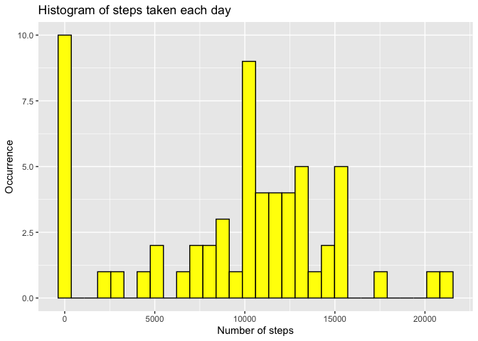
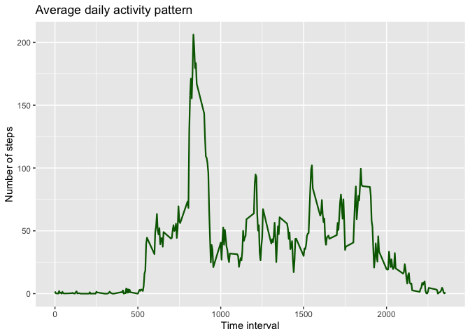
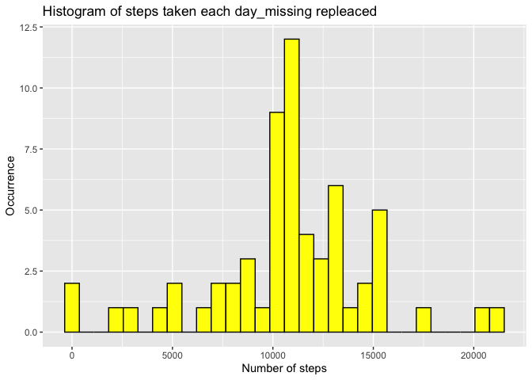
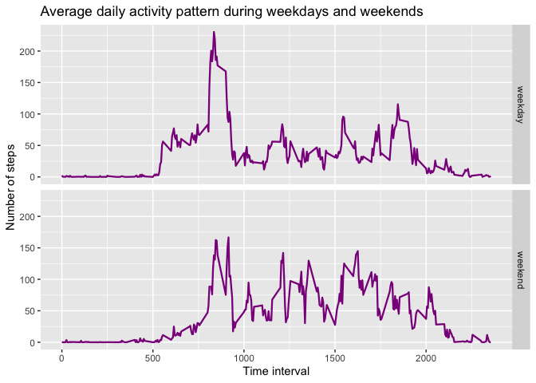

## Loading and preprocessing the data


```r
data<- read.csv("activity.csv")
data$date<- as.Date(data$date, "%Y-%m-%d")
```

## What is mean total number of steps taken per day?
Calculating mean of total numbers of steps per day:

```r
library(dplyr)
library(ggplot2)
data_gr <- group_by(data,date)
data_summ <- summarise(data_gr, daySum = sum(steps, na.rm = TRUE))
ggplot(data_summ, aes(x=daySum))+ geom_histogram(color="black", fill="yellow")+ 
        labs(title = "Histogram of steps taken each day", x= "Number of steps", y="Occurrence")
```

<!-- -->

```r
steps_Mean <- mean(data_summ$daySum, na.rm = TRUE)
steps_Med <- median(data_summ$daySum, na.rm = TRUE)
```
Mean of total number of steps per day: **9354.2295082**  
Median of total number of steps per day: **10395**

## What is the average daily activity pattern?
Calculating average daily activity pattern

```r
data_gr2 <- group_by(data,interval)
data_daily <- summarise(data_gr2, dailyPattern = mean(steps, na.rm = TRUE))
ggplot(data_daily, aes(interval, dailyPattern))+geom_line(size =0.8, color = "darkgreen") + labs(title = "Average daily activity pattern", x= "Time interval", y="Number of steps")
```

<!-- -->

```r
maxInterval <- data_daily$interval[which.max(data_daily$dailyPattern)]
```
5-minute interval with maximum number of steps (on average): **835**

## Imputing missing values
To fill missing values I used mean for that 5-minute interval collected in `data_daily`

```r
Rplace_na<- function(dataset, replace){
        for(i in 1:length(dataset$steps)){
                if(is.na(dataset$steps[i])){
                        interval <- which(replace$interval %in% dataset$interval[i])
                        dataset$steps[i] <- replace$dailyPattern[interval]
                }
        }
        dataset
}
Na_values <- sum(is.na(data))
data2 <- data
data2 <- Rplace_na(data2, data_daily)
```
Total number of missing values in the dataset: 2304 


```r
data_gr3 <- group_by(data2,date)
data_summ3 <- summarise(data_gr3, daySum = sum(steps))
ggplot(data_summ3, aes(x=daySum))+ geom_histogram(color="black", fill="yellow")+ 
        labs(title = "Histogram of steps taken each day_missing repleaced", x= "Number of steps", y="Occurrence")
```

<!-- -->

```r
steps_Mean3 <- round(mean(data_summ3$daySum),digits = 2)
steps_Med3 <-round(median(data_summ3$daySum), digits = 2)
```
Mean of total number of steps per day: **10766.19**  
Median of total number of steps per day: **10766.19**  
## Are there differences in activity patterns between weekdays and weekends?


```r
data_w <- mutate(data2, day_type = if_else(weekdays(date) == "Saturday" | weekdays(date)== "Sunday", "weekend", "weekday"))
data_w$day_type<- as.factor(data_w$day_type)
data_gr_w <- group_by(data_w,interval, day_type)
data_daily_w <- summarise(data_gr_w, dailyPattern = mean(steps, na.rm = TRUE))

ggplot(data_daily_w, aes(interval, dailyPattern))+geom_line(size =0.8, color = "darkmagenta")+ facet_grid(day_type ~.) + labs(title = "Average daily activity pattern during weekdays and weekends", x= "Time interval", y="Number of steps") 
```

<!-- -->

